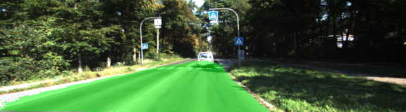

# Street-Segmentation
This project is from Udacity's Self-Driving Car curriculum.  They provided the helper functions as well as a canned VGG network with fully connected layers replaced with 1x1 convolutional layers.  Deconvolution was used to upsample the encoded classifications to the size of the original image in order to create a semantic segmentation.  Skip connections were used in order to fuse coarse, semantic and local, appearance information.  Skip connections were added between layers 4 and 9 and 3 and 10.  

## Results
Originally, I trained with 40 epochs with a dropout rate of 0.50.  However, this yieled results that were not optimal.  After tuning the hyperparameters, I found that 70 epochs with 0.75 dropout worked well.  The below figure shows a comparison between both the original and improved models.

Original          |  Improved
:-------------------------:|:-------------------------:
  |  

Here are some more results from the improved model:

